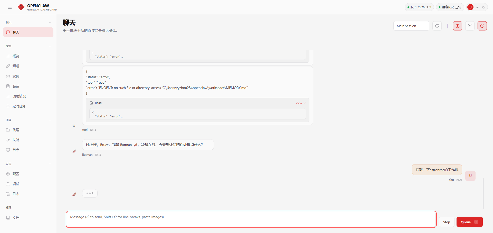
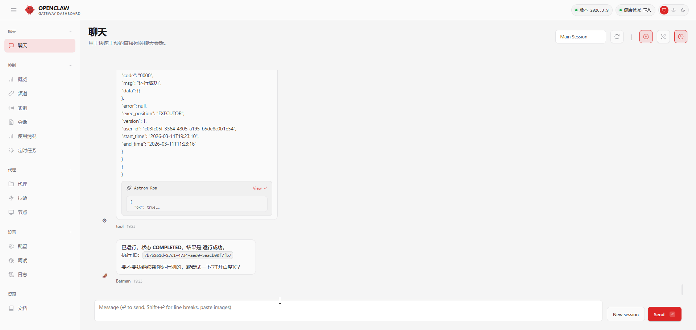

<h1> AstronRPA Connector for OpenClaw</h1>

This plugin connects OpenClaw to the AstronRPA Open API over HTTP.

For Chinese instructions, see [README.zh-CN.md](./README.zh-CN.md).

Current tool name: `astron_rpa`

Supported actions:

- `get_workflows`
- `execute_workflow_sync`

## Prerequisites

- A valid iFlyRPA Open API bearer token
- OpenClaw running from this repo checkout or able to install/link this plugin

## Install

### Option 1: Install from npm

```bash
openclaw plugins install @astronrpa/openclaw-plugin
```

### Option 2: Manual install

Download or copy this directory to:

```text
~/openclaw/extensions/astron-rpa
```

Make sure the directory contains:

- `plugin.ts`
- `openclaw.plugin.json`
- `package.json`

Then verify:

```bash
openclaw plugins list
```

You should see `astron-rpa` in the plugin list.

### Option 3: Install from a cloned GitHub repo

Clone the repository locally, then install it from the local directory:

```bash
git clone https://github.com/doctorbruce/AstronRPA-OpenClaw-Plugin.git
cd AstronRPA-OpenClaw-Plugin
openclaw plugins install -l .
```

Then verify:

```bash
openclaw plugins info astron-rpa
openclaw plugins list
```

Note:

- `openclaw plugins install` does not support GitHub repo URLs directly.
- Use a local path, a local `.zip` / `.tgz`, or publish the plugin to npm.

### Option 4: Install from a packaged archive

If you package the plugin as `.zip`, `.tgz`, or `.tar.gz`, install it from the local file:

```bash
openclaw plugins install ./astronrpa-openclaw-plugin-1.0.0.tgz
```

## openclaw.json

OpenClaw config is typically stored at:

```text
~/.openclaw/openclaw.json
```

On this Windows machine, that path is:

```text
C:\Users\zyzhou23\.openclaw\openclaw.json
```

Add the plugin config:

```json5
{
  plugins: {
    entries: {
      "astron-rpa": {
        enabled: true,
        config: {
          apiKey: "YOUR_IFLYRPA_BEARER_TOKEN",
          baseUrl: "https://newapi.iflyrpa.com/api/rpa-openapi",
          timeoutMs: 30000
        }
      }
    }
  }
}
```

Notes:

- `apiKey` is required.
- `baseUrl` is optional. If omitted, the plugin defaults to `https://newapi.iflyrpa.com/api/rpa-openapi`.
- `astron_rpa` is enabled by default once the plugin is loaded.
- If your config already uses `plugins.allow`, also add `astron-rpa` there.

Example:

```json5
{
  plugins: {
    allow: ["astron-rpa"]
  }
}
```

## Restart

After changing plugin files or `openclaw.json`, restart the Gateway.

## Usage

### 1. Get workflows

```json
{
  "action": "get_workflows"
}
```

This calls:

```text
GET https://newapi.iflyrpa.com/api/rpa-openapi/workflows/get
Authorization: Bearer <token>
```



### 2. Execute a workflow synchronously

```json
{
  "action": "execute_workflow_sync",
  "project_id": "1950846340813021184",
  "exec_position": "EXECUTOR",
  "params": {}
}
```

This calls:

```text
POST https://newapi.iflyrpa.com/api/rpa-openapi/workflows/execute
Authorization: Bearer <token>
Content-Type: application/json
```



## Publishing

For an independent repo, keep these files in the package root:

- `plugin.ts`
- `openclaw.plugin.json`
- `package.json`
- `README.md`
- `README.zh-CN.md`

If you publish to npm, users can install it with:

```bash
openclaw plugins install @astronrpa/openclaw-plugin
```

## Debugging

The plugin logs request URL, status code, content type, and a short preview when the response is not JSON.

Useful checks:

```bash
openclaw plugins info astron-rpa
openclaw plugins doctor
```

If the tool is not available to the agent, first check:

- `plugins.entries["astron-rpa"].enabled` is `true`
- `plugins.allow` contains `astron-rpa` if you use a plugin allowlist
